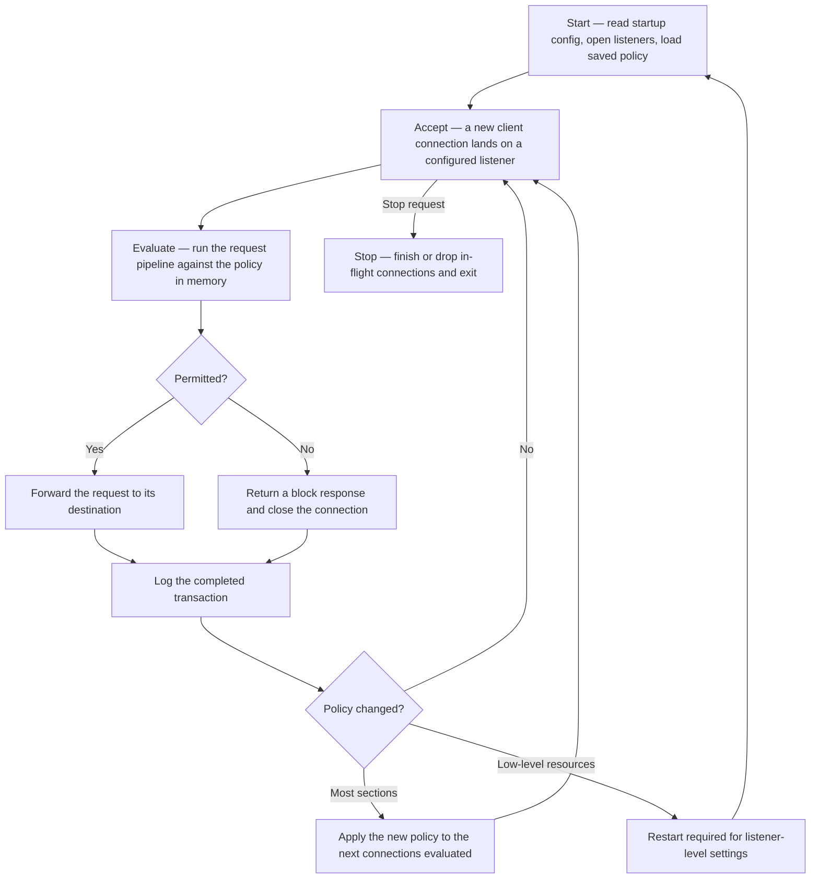

SafeSquid is the main proxy process on the Secure Web Gateway appliance. It accepts client connections, applies policies from the Web UI, and forwards allowed traffic.

{/* source: https://www.safesquid.com/md/daemon.md */}
## Lifecycle

1. **Start** — the daemon reads its own startup configuration, opens its configured listeners, loads the currently saved policy, and begins accepting connections.
2. **Accept** — each new client connection lands on a configured listener.
3. **Evaluate** — the connection runs through the request pipeline against whichever policy is currently loaded in memory.
4. **Forward or block** — a permitted request is forwarded to its destination; a denied request receives a block response and the connection is closed.
5. **Log** — each completed transaction is logged as it finishes.
6. **React to policy changes** — see [Live policy reload vs restart](#live-policy-reload-vs-restart).
7. **Stop** — on a stop request, the daemon finishes or drops any in-flight connections cleanly and exits.



### Live policy reload vs restart

Saving a change in the Web UI updates the running daemon's policy for most sections with no restart — the new policy applies to the next connections evaluated. A small minority of low-level settings need a restart because they affect resources the daemon opens only once at startup, such as listener sockets.

## Binary and service

- **Binary** — `/opt/safesquid/bin/safesquid`
- **Service user** — `ssquid` (group `root` on the appliance)
- **PID file** — `/var/run/safesquid/safesquid.pid`
- **Init script** — `/etc/init.d/safesquid`
- **systemd unit** — `/etc/systemd/system/safesquid.service`

## Command-line options

- **`-f`** — Run in the foreground (no double-fork). Use for debugging.
- **`-v`** — Print the build version and exit.

{/* source: https://www.safesquid.com/md/daemon.md */}
`-v` exits without starting the proxy at all, which makes it the quickest way to confirm exactly which build is installed before comparing two appliances or filing a support request.

Most tunables (listen address, thread limits, log levels) are set in `/opt/safesquid/startup.ini`, not on the command line.

{/* source: https://www.safesquid.com/md/daemon.md */}
**Foreground mode** runs the daemon attached to the invoking session, so its own startup output and any immediate errors are visible directly, instead of only a generic service-manager failure summary. Use it for first-time setup and low-level troubleshooting, not day-to-day operation. It applies to both the `-f` flag above and the `foreground` service verb below.

## Service control

```
/etc/init.d/safesquid start
/etc/init.d/safesquid stop
/etc/init.d/safesquid restart
/etc/init.d/safesquid status
/etc/init.d/safesquid foreground
```

## Important paths

- **Policy** — `/usr/local/safesquid/security/policies/config.xml`
- **Web UI** — `/usr/local/safesquid/ui_root/` — browse at `http://safesquid.cfg/`
- **Logs** — `/var/log/safesquid/` (native, extended, config, performance, …)
- **Cache** — `/var/cache/safesquid/`
- **Startup settings** — `/opt/safesquid/startup.ini`, `/opt/safesquid/setup.ini` — see [startup.ini tunables](/configuration/start_here/startup_ini) (not in sectionMaster)

{/* source: https://www.safesquid.com/md/daemon.md */}
<Warning>
  Editing `/usr/local/safesquid/security/policies/config.xml` directly, outside the Web UI, is **unsupported** and risks putting the running daemon and the Web UI's view of policy out of sync.
</Warning>

## Subscription and updates

Background UPDATE hooks refresh application signatures, content signatures, categorisation feeds, and related databases. License state is managed under [Subscription](/configuration/infrastructure_and_access/subscription) in the Web UI; see [Cloud / categorisation feeds](/configuration/start_here/cloud_feeds) for paths under `/var/lib/safesquid/`.

{/* source: https://www.safesquid.com/md/daemon.md */}
This refresh runs on its own schedule, with no restart and no interruption to active connections.

{/* source: https://www.safesquid.com/md/daemon.md */}
## Common problems

- **Service shows stopped but was not deliberately stopped** — check status, then start it. If it will not stay up, run Foreground so the real startup error surfaces rather than a generic failure.
- **A Web UI change appears to have no effect** — confirm it was actually saved, not just typed into a field. Most sections apply live; restarting to "fix" a section that should already apply live usually masks the real problem.
- **Need the exact installed build** — use the version flag rather than inferring it from the Web UI, especially when comparing appliances or filing a support request.
- **Suspected conflicting or unexpected policy** — check Config logs for the most recent changes and who made them before assuming the daemon is misbehaving; most such reports are an unnoticed policy change.

{/* source: https://www.safesquid.com/md/daemon.md */}
## How to verify

1. Confirm status reports running with a valid PID file.
2. Send one test request and confirm it appears in **Reports → Detailed logs**.
3. After a change expected to need a restart, restart and re-test rather than assuming it applied live.
4. If startup itself is in doubt, stop the service and start in Foreground.
5. Confirm the build with the version flag after an upgrade.

## See also

- [First configuration](/configuration/start_here/first_configuration)
- [Architecture and request pipeline](/configuration/start_here/architecture)
- [Access restrictions](/configuration/application_setup/access_restrictions)
- [Subscription](/configuration/infrastructure_and_access/subscription)
- [Logging and troubleshooting](/configuration/start_here/logging)
