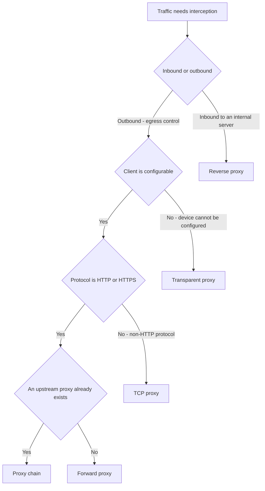

# Decide Where Traffic Is Intercepted

The interception point determines what SafeSquid can enforce. Choose it before sizing, before firewall changes, and before any client is touched — the choice drives client configuration effort, coverage gaps, and how easily a user can route around the control.

SafeSquid cannot enforce policy on traffic that bypasses the proxy. Every mode below is a different answer to how you stop that from happening.

Work through the decision in this order — direction of traffic, then whether the client can be configured, then protocol and upstream constraints — and confirm the result against the table below.

## Match the mode to the constraint

| Mode | Traffic reaches SafeSquid because | Costs you | Bypass risk |
|---|---|---|---|
| Forward proxy | The client is configured to send it | Client rollout on every endpoint | User can remove the proxy setting |
| Transparent proxy | The network redirects it | Router, switch, or firewall change | Low for managed paths; none for the user to undo |
| TCP proxy | The client targets a proxied TCP port | Per-protocol configuration | Depends on the routing in front of it |
| Reverse proxy | External clients resolve to SafeSquid | Public DNS and certificate ownership | Not applicable — inbound, not outbound |
| Proxy chain | An upstream proxy forwards it | Coordination with the upstream owner | Inherited from the upstream tier |

Start with forward proxy for a pilot even when transparent is the production target. Explicit configuration makes it obvious which client is being tested and easy to roll back.

## Understand what each mode enforces

Each mode trades control, coverage, and rollback differently. Open the one that matches the row you picked above.

<Accordion title="What forward proxy requires">
  Requires explicit client configuration through browser settings, a [PAC file](/getting_started/client_configuration/pac_file), or system-level proxy settings. It gives the most granular control over which clients are proxied, and the clearest rollback — remove the setting. It also means an endpoint that misses the rollout is silently unprotected.
</Accordion>

<Accordion title="What transparent proxy requires">
  Intercepts traffic through network-level redirection, with no client configuration. Coverage is comprehensive for everything on the redirected path, including devices you cannot configure. The cost moves to the network team, and a routing change made without coordination can take the control offline for everyone at once.
</Accordion>

<Accordion title="What TCP proxy requires">
  [TCP proxy](/use_cases/scaling_and_high_availability/tcp_proxy) operates at the TCP layer for non-HTTP protocols that still need inspection and control. Use it where an application will not honour an HTTP proxy but its traffic must still be governed.
</Accordion>

<Accordion title="What reverse proxy requires">
  [Reverse proxy](/use_cases/scaling_and_high_availability/reverse_proxy) protects internal web servers from direct internet access, terminating TLS and applying authentication in front of them. This is the inbound case — it does not replace an outbound egress control.
</Accordion>

<Accordion title="What proxy chain requires">
  [Proxy chain](/use_cases/scaling_and_high_availability/proxy_chain) places SafeSquid in a multi-tier architecture, forwarding to or receiving from another proxy. Use it where an existing upstream proxy cannot be removed, and confirm which tier owns policy before splitting enforcement across both.
</Accordion>

## Design the network placement

Once the mode is chosen, document where it sits:

- Explicit proxy for pilot clients and controlled validation.
- PAC file or managed OS proxy for browser rollout.
- Firewall or routing policy only when the network team can enforce bypass controls safely.
- Cloud egress placement for workloads or remote sites that already route through a cloud network.

Record source networks, proxy listener ports, DNS servers, NTP sources, upstream gateways, and firewall rules. Name an owner for every routing or firewall policy that forwards traffic toward SafeSquid — an unowned redirect is the one nobody restores after an outage.

## Capture the architecture decision

Store these artifacts with the deployment record:

- The chosen mode and the constraint that drove it.
- A network placement diagram showing the interception point.
- Source networks and listener ports, with the firewall change record.
- The named owner of any routing, [WCCP](/use_cases/scaling_and_high_availability/wccp), or redirect policy.
- The rollback path for the interception change, and its owner.

## Troubleshoot architecture choices

| Symptom | Likely cause | Fix |
|---|---|---|
| Some clients are never logged | Forward proxy rollout missed those endpoints | Reconcile the endpoint inventory against access-log sources before widening policy |
| Traffic bypasses the proxy after a network change | Redirect policy was modified without coordination | Name an owner for the redirect and add it to the network change process |
| An application breaks under inspection | Protocol will not honour an HTTP proxy, or pins its certificate | Move it to TCP proxy, or add a documented exclusion with a business owner |
| Policy applies twice, or not at all | Two tiers in a proxy chain both claim enforcement | Assign policy ownership to one tier and make the other pass through |
| Internal servers are exposed | Reverse proxy was assumed to cover outbound egress | Deploy a separate outbound mode; reverse proxy is inbound only |

## Next steps

- [Forward Proxy](/use_cases/scaling_and_high_availability/forward_proxy) - configure the explicit path used for most pilots.
- [Transparent Proxy](/use_cases/scaling_and_high_availability/transparent_proxy) - intercept without touching clients.
- [Resource Planning](/deployment/resource_planning) - size the node once placement is decided.
