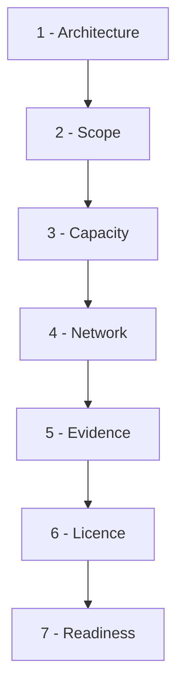

# Plan the Control Path First

SafeSquid becomes a production control only when the proxy is sized, reachable, monitored, and able to preserve enforcement evidence. Poor planning causes dropped sessions, weak audit trails, certificate failures, and emergency routing changes during rollout.

This page is the map. Each stage links to the page that carries the detail.

The seven stages run in sequence — each depends on the decision made in the one before it.

## Work the stages in order

| Stage | Decide | Detail |
|---|---|---|
| 1. Architecture | Where traffic is intercepted | [Choose an Architecture](/deployment/choose_an_architecture) |
| 2. Scope | What the first deployment must prove | [Pilot Versus Production](/deployment/pilot_versus_production) |
| 3. Capacity | What to measure, then what to buy | [Resource Planning](/deployment/resource_planning), [Sizing](/deployment/sizing) |
| 4. Network | Which ports and endpoints, to which scopes | [Ports and Firewall Rules](/deployment/ports_and_firewall_rules) |
| 5. Evidence | How long logs survive, and who owns them | [Log-Retention Planning](/deployment/log_retention_planning) |
| 6. Licence | Which tier the design assumes | [Licensing Requirements](/deployment/licensing_requirements) |
| 7. Readiness | Everything confirmed before an installer runs | [Deployment Checklist](/getting_started/install_safesquid/prerequisites) |

Decisions made out of order tend to be remade. Sizing before the architecture is chosen, or policy design before the licence tier is settled, produces rework that surfaces during rollout rather than during planning.

## Choose the deployment scenario

<Steps>
  <Step title="Choose new appliance deployment">
    <Card title="New VM or hardware appliance" icon="hard-drive" href="/getting_started/install_safesquid/safesquid_appliance_builder">
      Use the Appliance Builder when a dedicated disk and bootable ISO workflow are approved.
    </Card>

    Confirm the appliance has approved CPU, RAM, disk, NIC, and rebuild ownership.

    If the disk cannot be dedicated, choose cloud or managed Linux instead.
  </Step>
  <Step title="Choose cloud or hybrid egress">
    <Card title="Cloud or hybrid egress" icon="cloud" href="/getting_started/install_safesquid/cloud_deployment">
      Use cloud deployment when security groups, route tables, snapshots, and egress paths are owned.
    </Card>

    Confirm security groups, routes, snapshots, and egress paths have named owners.

    If egress ownership is unclear, pause deployment until network ownership is assigned.
  </Step>
  <Step title="Choose managed Linux server">
    <Card title="Existing managed Linux server" icon="terminal" href="/getting_started/install_safesquid/linux_server">
      Use Linux install only when OS hardening, dependencies, monitoring, and rollback are already owned.
    </Card>

    Confirm OS lifecycle and rollback are approved by the server owner.

    If dependency drift is likely, use Appliance Builder for a cleaner baseline.
  </Step>
  <Step title="Choose cluster or DR design">
    <Card title="Cluster or DR design" icon="refresh-cw" href="/use_cases/scaling_and_high_availability/proxy_clustering">
      Add HA or DR planning when uptime requirements need failover, configuration sync, and tested restore.
    </Card>

    Confirm RTO, RPO, failover, restore, and configuration-sync requirements are documented.

    If HA ownership is missing, keep the first deployment single-node until DR controls are approved.
  </Step>
</Steps>

## Capture planning evidence

Store these artifacts before installation begins:

- Sizing worksheet or change record.
- Network placement diagram.
- Firewall and routing approval.
- Log retention target.
- Activation key storage reference.
- Rollout and rollback plan.
- DR or rebuild assumptions.

Detailed evidence lists live with each stage. This is the set that must exist before an installer runs.

## Troubleshoot planning gaps

| Symptom | Likely cause | Fix |
|---|---|---|
| Sizing cannot be approved | User, throughput, or inspection scope is unknown | Run a pilot and record peak concurrent connections; see [Resource Planning](/deployment/resource_planning) |
| Logs cannot be retained | Disk or SIEM ownership is unclear | Assign a retention owner and capacity target; see [Log-Retention Planning](/deployment/log_retention_planning) |
| HTTPS rollout stalls | Root CA deployment path is missing | Choose GPO, MDM, or approved manual trust deployment before enabling inspection |
| HA design is unclear | Failover and synchronization requirements are undefined | Document routing, health checks, same-key activation, and restore steps |
| Decisions keep being revisited | Stages were worked out of order | Return to the stage table above and settle architecture before capacity |

## Next steps

- [Choose an Architecture](/deployment/choose_an_architecture) - start here for a new deployment.
- [Deployment Checklist](/getting_started/install_safesquid/prerequisites) - convert the plan into install readiness checks.
- [Production-Readiness Checklist](/getting_started/verify_your_setup) - the condition the deployment must eventually meet.
