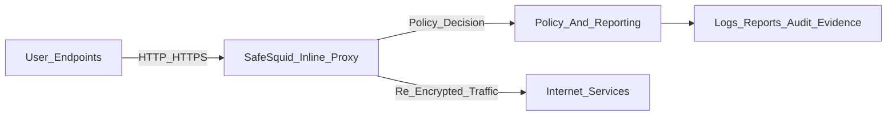

# Web Sessions Carry Business-Critical Risk

Phishing, ransomware delivery, command-and-control callbacks, credential theft, and data exfiltration now arrive through approved HTTP and HTTPS traffic. If that traffic is trusted by default, organizations face operational disruption, legal exposure, and reportable incidents.

Layer 3 and Layer 4 controls block unauthorized network paths, but they do not enforce user-intent and content-risk policy inside approved web sessions. Production web security requires an inline Layer 7 proxy that can terminate sessions, inspect payloads, enforce policy, and produce auditable evidence.

## SafeSquid Enforces Inline Web Control

SafeSquid runs as an inline HTTP/HTTPS proxy at the perimeter. Enrolled clients send web traffic through SafeSquid before internet access. This control path lets teams:

- Block phishing destinations and credential-harvesting pages before credential submission
- Disrupt malware download and command-and-control traffic
- Enforce data-loss prevention controls on outbound HTTP and HTTPS channels
- Isolate high-risk browsing through Remote Browser Isolation (RBI)
- Record per-transaction logs for incident response and audit workflows

SafeSquid supports evidence-oriented controls mapped to [NIST SP 800-53](https://csrc.nist.gov/publications/detail/sp/800-53/rev-5/final), [PCI-DSS](https://www.pcisecuritystandards.org/document_library/), [HIPAA](https://www.hhs.gov/hipaa/index.html), [ISO 27001](https://www.iso.org/standard/27001), [SOC 2](https://www.aicpa-cima.com/resources/landing/system-and-organization-controls-soc-suite-of-services), [RBI Master Direction on IT Governance 2023](https://www.rbi.org.in/Scripts/BS_ViewMasDirections.aspx?id=12562), [SEBI CSCRF](https://www.sebi.gov.in/legal/circulars/aug-2024/cybersecurity-and-cyber-resilience-framework-cscrf-for-sebi-regulated-entities-res-_85964.html), and the [DPDP Act](https://www.meity.gov.in/static/uploads/2024/06/2bf1f0e9f04e6fb4f8fef35e82c42aa5.pdf).

## SafeSquid Inspects Every Transaction

For HTTPS traffic, SafeSquid terminates the client-side TLS session, inspects headers and payload, applies policy, then re-encrypts traffic to the origin server. Security processors evaluate the same transaction context, which reduces fragmented controls and improves decision consistency.

## Confirm System Requisites

Before installation, confirm the platform choice and pilot capacity baseline:

- Preferred path: SafeSquid Appliance Builder for clean appliance-style deployment
- Alternate path: Linux package deployment when platform standards require it
- Minimum pilot hardware: `4` CPU cores, `4 GB` RAM, `160 GB` storage
- Recommended production starting point: `8` CPU cores and `8 GB` RAM

For full platform prerequisites, sizing decisions, and network dependencies, use [Install Prerequisites](/getting_started/install_safesquid/prerequisites) and [Deployment Planning](/getting_started/deployment_planning).

## Prepare A Controlled Pilot

Before onboarding users, confirm:

- A deployment owner and change record are defined
- The `activation_key` storage location is approved and access-controlled
- Topology, sizing, firewall, DNS, NTP, and rollback decisions are documented
- A Root CA rollout path exists for managed endpoints
- Log retention and reporting ownership are assigned

Use [Deployment Planning](/getting_started/deployment_planning) and [Install Prerequisites](/getting_started/install_safesquid/prerequisites) to complete these controls before installation.

<Steps>
  <Step title="Register and secure the activation key">
    Create an account in the [SafeSquid Self-Service Portal](/getting_started/register) and download the `activation_key`.

    Confirm the key is stored in approved secure storage with controlled access.

    If the file is missing or renamed, re-download it before activation.
  </Step>
  <Step title="Install the selected platform">
    Choose the approved install path in [Install SafeSquid](/getting_started/install_safesquid), then complete that platform guide.

    Confirm SafeSquid service health and listener readiness before client routing.

    If platform ownership or baseline requirements are unresolved, stop rollout and return to deployment planning.
  </Step>
  <Step title="Confirm management portal access path">
    Open the Configuration Portal from a proxied pilot browser at `http://safesquid.cfg/`.

    If the proxied path is unavailable during controlled setup, use direct administrator access at `https://SAFESQUID-SERVER-IP:8443/` from an approved management network.

    If neither path works, pause activation and resolve listener, proxy, or administrator network controls first.
  </Step>
  <Step title="Route one pilot client through SafeSquid">
    Use [Connect Your Client](/getting_started/client_configuration/connect_your_client) to configure explicit proxy, PAC, system-wide proxy, or managed rollout.

    Confirm one pilot request appears in `/var/log/safesquid/access/extended.log`.

    If traffic bypasses the proxy, verify proxy settings, PAC output, and bypass rules.
  </Step>
  <Step title="Activate and apply baseline controls">
    Complete [Activate Your License](/getting_started/activate), then run [Configure Web Security Policies](/getting_started/configure_web_security_policies).

    Confirm a test request produces the expected allow, block, inspect, or log action.

    If policy outcome differs from design, check rule order, identity attribution, and bypass entries.
  </Step>
</Steps>

## Prove Production Readiness

Before expanding beyond pilot users, collect and attach evidence to the deployment record:

- Activation proof: license details visible in the Configuration Portal
- Routing proof: first pilot transaction in `/var/log/safesquid/access/extended.log`
- HTTPS trust proof: pilot endpoint trusts the SafeSquid Root CA and browses without trust warnings
- Policy proof: at least one expected allow or block event mapped to a known policy rule
- Audit proof: report or log export includes user, source, URL, action, and timestamp

Use [Verify Your Setup](/getting_started/verify_your_setup) for the full production sign-off workflow.

## Immediate Next Controls

After pilot evidence is stable, apply these two controls first:

1. HTTPS inspection with trusted Root CA rollout for managed endpoints.
2. Identity integration with Active Directory or OpenLDAP for accountable policy enforcement.

Use [Configure Web Security Policies](/getting_started/configure_web_security_policies) to sequence these controls without breaking pilot stability.

## Troubleshoot First Pilot

If a pilot check fails, use the matching symptom below and capture corrected evidence before expanding rollout.

<AccordionGroup>
  <Accordion title="No pilot request appears in access logs">
    The pilot client is not routing through SafeSquid, so policy and audit controls are not being enforced.

    **Likely cause:** Browser or host proxy settings, PAC output, or bypass rules are directing traffic around SafeSquid.

    **Fix:**
    1. Reapply the selected routing method using [Connect Your Client](/getting_started/client_configuration/connect_your_client).
    2. Retest with a single pilot request.
    3. Confirm the client is pointing to the approved proxy IP and port.
    4. Remove unapproved bypass entries from pilot settings.

    **Verify:** `/var/log/safesquid/access/extended.log` records a new pilot entry with source, destination, action, and timestamp.
  </Accordion>

  <Accordion title="Configuration Portal does not load through proxy">
    Operators cannot complete activation and policy setup when `http://safesquid.cfg/` is unreachable through the proxy path.

    **Likely cause:** Pilot browser bypasses the proxy or SafeSquid listener access is blocked.

    **Fix:**
    1. Follow [Access the Interface](/getting_started/access_the_interface) from a proxied pilot browser.
    2. Confirm the pilot browser proxy settings are active.
    3. Validate SafeSquid listener state on the gateway.
    4. Retry `http://safesquid.cfg/` from the same pilot path.
    5. If needed, test direct management fallback from an approved administrator network at `https://SAFESQUID-SERVER-IP:8443/`.

    **Verify:** `http://safesquid.cfg/` or approved direct fallback `https://SAFESQUID-SERVER-IP:8443/` allows Configuration Portal access.
  </Accordion>

  <Accordion title="HTTPS browsing fails after inspection enablement">
    HTTPS controls cannot be trusted in production when endpoints do not trust the SafeSquid Root CA or inspection scope is too broad for pilot stage.

    **Likely cause:** Root CA deployment is incomplete, or inspection policy includes destinations not ready for decryption.

    **Fix:**
    1. Complete Root CA rollout for the pilot endpoint.
    2. Keep inspection scope limited to approved pilot destinations.
    3. Re-run the HTTPS pilot test from the managed client.
    4. Review SSL policy scope in [Configure Web Security Policies](/getting_started/configure_web_security_policies).

    **Verify:** HTTPS pilot sessions complete without trust warnings and logs show expected policy action.
  </Accordion>

  <Accordion title="Audit records are incomplete for pilot traffic">
    Missing user, action, or timestamp details reduce incident response quality and delay audit acceptance.

    **Likely cause:** Identity mapping, retention policy, or reporting export configuration is incomplete.

    **Fix:**
    1. Use [Verify Your Setup](/getting_started/verify_your_setup) to confirm log and evidence requirements.
    2. Enable identity-aware policy attribution for pilot users.
    3. Configure log retention and export path before expansion.
    4. Re-run one controlled pilot request and capture output.

    **Verify:** Exported evidence includes user, source, URL, action, and timestamp for the new pilot request.
  </Accordion>
</AccordionGroup>

## Next steps

- [Deployment Planning](/getting_started/deployment_planning) - finalize ownership, topology, and rollback decisions.
- [Install SafeSquid](/getting_started/install_safesquid) - deploy the approved platform path.
- [Verify Your Setup](/getting_started/verify_your_setup) - run production-readiness checks before expansion.
- [Troubleshooting](/troubleshooting/troubleshooting) - diagnose routing, certificate trust, and policy enforcement failures.
