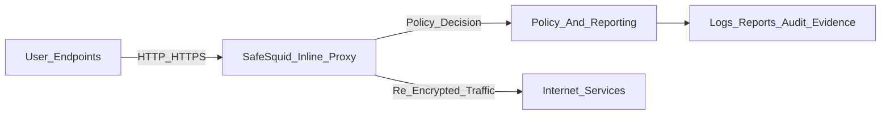

# Web Sessions Carry Business-Critical Risk

Phishing, ransomware delivery, command-and-control callbacks, credential theft, and data exfiltration now arrive through approved HTTP and HTTPS traffic. If that traffic is trusted by default, organizations face operational disruption, legal exposure, and reportable incidents.

Layer 3 and Layer 4 controls block unauthorized network paths, but they do not enforce user-intent and content-risk policy inside approved web sessions. Production web security requires an inline Layer 7 proxy that can terminate sessions, inspect payloads, enforce policy, and produce auditable evidence.

## SafeSquid Enforces Inline Web Control

SafeSquid runs as an inline HTTP/HTTPS proxy at the perimeter. Enrolled clients send web traffic through SafeSquid before internet access. This control path lets teams:

- Block phishing destinations and credential-harvesting pages before credential submission
- Disrupt malware download and command-and-control traffic
- Enforce data-loss prevention controls on outbound HTTP and HTTPS channels
- Isolate high-risk browsing through Remote Browser Isolation (RBI)
- Record per-transaction logs for incident response and audit workflows

SafeSquid supports evidence-oriented controls mapped to [NIST SP 800-53](https://csrc.nist.gov/publications/detail/sp/800-53/rev-5/final), [PCI-DSS](https://www.pcisecuritystandards.org/document_library/), [HIPAA](https://www.hhs.gov/hipaa/index.html), [ISO 27001](https://www.iso.org/standard/27001), [SOC 2](https://www.aicpa-cima.com/resources/landing/system-and-organization-controls-soc-suite-of-services), [RBI Master Direction on IT Governance 2023](https://www.rbi.org.in/Scripts/BS_ViewMasDirections.aspx?id=12562), [SEBI CSCRF](https://www.sebi.gov.in/legal/circulars/aug-2024/cybersecurity-and-cyber-resilience-framework-cscrf-for-sebi-regulated-entities-res-_85964.html), and the [DPDP Act](https://www.meity.gov.in/static/uploads/2024/06/2bf1f0e9f04e6fb4f8fef35e82c42aa5.pdf).

## SafeSquid Inspects Every Transaction

For HTTPS traffic, SafeSquid terminates the client-side TLS session, inspects headers and payload, applies policy, then re-encrypts traffic to the origin server. Security processors evaluate the same transaction context, which reduces fragmented controls and improves decision consistency.

