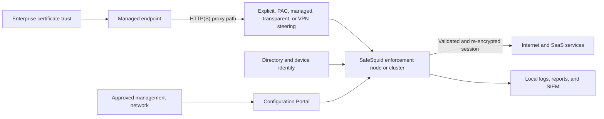

# Plan the Control Path Before the Appliance

A Secure Web Gateway changes how users reach web services. The design must account for traffic routing, identity, TLS trust, policy processing, upstream dependencies, evidence, and recovery as one control path. Installing software before these decisions are recorded creates avoidable outages and undocumented bypasses.

## Decisions required before change approval

| Decision | Input owner | Required output |
| --- | --- | --- |
| Business scope | Security and application owners | Users, networks, applications, and locations included in the pilot and production rollout |
| Traffic steering | Network architecture | Explicit proxy, PAC, managed system proxy, transparent redirection, VPN, or an approved combination |
| Identity | Identity and endpoint teams | User and device attribution method, group source, failure behavior, and test accounts |
| TLS trust | PKI and endpoint teams | Issuing CA, managed trust rollout, bypass governance, and certificate lifecycle owner |
| Capacity | Infrastructure team | Peak concurrency, traffic profile, retention demand, growth margin, and approved node specification |
| Availability | Service owner | Single-node pilot or clustered production design, health checks, failover behavior, RTO, and RPO |
| Evidence | SOC and compliance teams | Required logs, fields, retention, time source, SIEM destination, and review ownership |
| Recovery | Change owner | Backup, rollback trigger, restoration method, decision authority, and maximum outage |

Use the [Deployment Readiness Workbook](/plan/deployment-readiness-workbook) to collect these inputs without sending them to SafeSquid or any external service.

## Reference traffic path

The final diagram for a deployment must show bypass routes, management access, cluster relationships, DNS, NTP, update services, directory services, log destinations, and failure behavior. A diagram that shows only the proxy and internet path is not sufficient for production review.

## Plan by risk

<Tabs>
  <Tab title="Pilot">
    Use one node and a small managed endpoint group. Keep rollback local and immediate. Prove routing, activation, trust, identity, policy, logging, and bypass behavior before expanding scope.
  </Tab>
  <Tab title="Production">
    Add availability, capacity margin, controlled administration, backup, monitoring, certificate lifecycle, log retention, change control, and tested recovery.
  </Tab>
  <Tab title="Regulated">
    Add named control owners, immutable or protected evidence destinations, synchronized time, privileged-access review, documented inspection exclusions, data handling boundaries, and mapped control evidence.
  </Tab>
</Tabs>

## Architecture outputs

Before installation, attach these artifacts to the change record:

- Approved topology and trust-boundary diagram
- Completed input and dependency worksheet
- Supported platform and build decision
- Port and protocol validation record
- Capacity assumption and review owner
- Identity and certificate rollout plan
- Security control sequence and test matrix
- Logging, evidence, and retention plan
- Backup, rollback, RTO, and RPO plan
- Pilot users, success criteria, and stop conditions

<Warning>
  Do not infer production sizing, protocol requirements, or failover behavior from an unverified example. Record the assumptions and obtain product or lab validation for the selected release train.
</Warning>

## Continue the design

- [Deployment Planning](/getting_started/deployment_planning) converts the architecture into an actionable deployment record.
- [Regulated Enterprise Reference Architecture](/plan/reference-architecture) shows the required trust boundaries and evidence paths.
- [Deploy SafeSquid](/deploy/overview) selects the supported installation path.
- [Assurance and Evidence](/assurance/overview) defines control claims and proof without asserting automatic compliance.