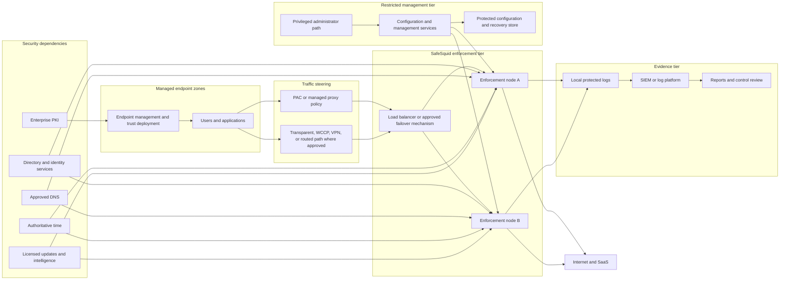

# Reference Architecture for a Regulated Enterprise

This design separates endpoint management, traffic enforcement, administration, identity, trust, evidence, and recovery. It is a starting point for review, not a universal topology. Replace every placeholder with an approved value and validate node roles, protocols, ports, health checks, and failure behavior for the selected build.

## Trust boundaries

| Boundary | Required decision |
| --- | --- |
| Endpoint to steering | Who controls proxy settings, PAC delivery, bypasses, VPN, and direct egress? |
| Steering to enforcement | How are node health, distribution, source attribution, and return paths verified? |
| Endpoint TLS trust | Which CA is approved, how is its public certificate deployed, and who protects the private key? |
| Enforcement to origin | Which TLS versions, validation rules, exceptions, and upstream proxy paths are approved? |
| Identity to enforcement | Which identities and groups are authoritative, and what happens when the directory is unavailable? |
| Administration | Which networks and roles can change policy, retrieve evidence, or access recovery material? |
| Evidence | How are logs transferred, time-aligned, protected, retained, reviewed, and disposed? |
| Recovery | Who can restore configuration, rotate trust, invoke failover, or authorize temporary exceptions? |

## Normal traffic outcome

For an in-scope managed request, the expected evidence chain is:

1. The endpoint receives the approved steering and trust configuration.
2. The request reaches an approved enforcement node.
3. SafeSquid records the expected source and identity context.
4. TLS handling follows the approved inspect or bypass decision.
5. Policy produces the expected allow, deny, transform, or log action.
6. The client receives the expected response.
7. Local and central evidence records the decision with synchronized time.
8. The event can be traced from the client test to the retained evidence.

## Failure design

| Failure | Required production behavior to decide and test |
| --- | --- |
| One enforcement node fails | Health detection, removal from service, session effect, capacity margin, and evidence continuity |
| Management service fails | Existing enforcement behavior, change restrictions, recovery path, and administrative evidence |
| Directory fails | Authentication failure policy, cached context, exception boundary, alert, and recovery |
| DNS fails | Resolver failover or stop behavior, alert, affected scope, and verification |
| NTP drifts | Alert threshold, certificate and authentication impact, log reliability, and correction |
| Update or intelligence service fails | Last-known state, expiry behavior, alert, risk acceptance, and recovery |
| SIEM is unavailable | Local buffering or retention, loss boundary, alert, replay, and evidence reconciliation |
| CA or certificate approaches expiry | Ownership, alert horizon, staged rotation, rollback, and client validation |
| Capacity is exhausted | Thresholds, admission or degradation behavior, scaling action, and incident evidence |

No failure behavior in this table is assumed to be a product default. The deployment owner must replace each item with a release-verified result.

## Pilot variant

The pilot may use one enforcement node and a small managed endpoint group. It must still use controlled administration, approved trust, identity, time, evidence, backup, and rollback. A smaller topology reduces scale; it does not remove security or evidence requirements.

## Architecture acceptance

The architecture review is complete when every component, data flow, trust boundary, dependency, failure response, evidence path, owner, and test is visible. Unresolved behavior remains an explicit risk and cannot be hidden in an implementation note.