# Make Each Policy Decision Explainable

A policy is production-ready when an operator can state which traffic it matches, which context it depends on, which action it takes, what it logs, how to test it, and how to reverse it. Enabling multiple controls at once hides dependencies and makes failure analysis unreliable.

## Apply controls in a known order

```mermaid
flowchart LR
    Traffic["Client request"] --> Route["Confirmed proxy path"]
    Route --> Trust["TLS trust and inspection scope"]
    Trust --> Identity["User, device, network, and time context"]
    Identity --> Profile["Request and response profiles"]
    Profile --> Access["Access and application decision"]
    Access --> Content["Malware, content, and DLP processing"]
    Content --> Transform["Header, cookie, URL, or content change"]
    Transform --> Evidence["Transaction logs, reports, and SIEM"]
```

The exact processing order and field behavior must be verified for the selected build. The diagram expresses the operator's validation sequence, not an undocumented internal execution guarantee.

## Build the test matrix first

For every new or changed control, define:

| Test field | Required value |
| --- | --- |
| Test identity and source | Synthetic user, group, device, and network |
| Request | Benign URL, method, content type, or application action |
| Expected match | Named policy or profile |
| Expected action | Allow, deny, inspect, bypass, transform, quarantine, or log |
| Expected client result | Page, block response, download result, or application behavior |
| Expected evidence | Log path, event fields, report, alert, or SIEM record |
| Negative test | Similar traffic that must not match |
| Rollback | Exact rule disablement or previous configuration restoration |
| Owner | Person or role that accepts the result |

Use [Configure Web Security Policies](/getting_started/configure_web_security_policies) for the controlled baseline.

## Security control areas

<CardGroup cols={2}>
  <Card title="TLS inspection" icon="lock" href="/use_cases/ssl_inspection/ssl_inspection">
    Define inspection scope, managed trust, certificate lifecycle, exclusions, and failure behavior.
  </Card>

  <Card title="Authentication and identity" icon="user-check" href="/use_cases/authentication/authentication">
    Attribute traffic to approved user, device, network, and directory context.
  </Card>

  <Card title="Profiling engine" icon="sliders-horizontal" href="/use_cases/profiling_engine/profiling_engine">
    Build reusable request, response, application, and time context for policy decisions.
  </Card>

  <Card title="DNS security" icon="globe-lock" href="/use_cases/dns_security/dns_security">
    Apply reputation, block-list, geography, and name-based controls with explicit resolution tests.
  </Card>

  <Card title="Malware scanning" icon="bug-off" href="/use_cases/malware_scanning/malware_scanners">
    Validate scanner availability, update state, test artifacts, action, latency, and evidence.
  </Card>

  <Card title="Access restriction" icon="shield-ban" href="/use_cases/access_restriction/access_restriction">
    Enforce user, group, time, destination, category, and application decisions.
  </Card>

  <Card title="Data leakage prevention" icon="file-lock" href="/use_cases/data_leakage_prevention/data_leakage_prevention">
    Test permitted and prohibited egress using synthetic data that cannot expose real confidential information.
  </Card>

  <Card title="Audit and forensics" icon="scan-search" href="/use_cases/audit_and_forensics/audit_forensics">
    Preserve sufficient context to reconstruct the decision and support an investigation.
  </Card>
</CardGroup>

## Change discipline

<Steps>
  <Step title="Capture the current baseline">
    Export or record the approved configuration and reproduce the current allow and deny tests.
  </Step>
  <Step title="Change one control boundary">
    Introduce one profile, rule, integration, signature set, or inspection scope change.
  </Step>
  <Step title="Run positive and negative tests">
    Confirm intended traffic matches and adjacent traffic does not.
  </Step>
  <Step title="Inspect all evidence">
    Compare client behavior, SafeSquid logs, reports, upstream service state, and SIEM receipt.
  </Step>
  <Step title="Test the reversal">
    Disable the new rule or restore the prior configuration and reproduce the baseline.
  </Step>
</Steps>

<Warning>
  Never use live malware, real credentials, regulated records, or customer confidential data to prove a policy. Use approved benign test artifacts and synthetic data.
</Warning>

## Production acceptance

A control is accepted only when its scope, dependencies, expected outcomes, negative tests, evidence, performance impact, failure behavior, owner, and rollback have been recorded for the verified release build.