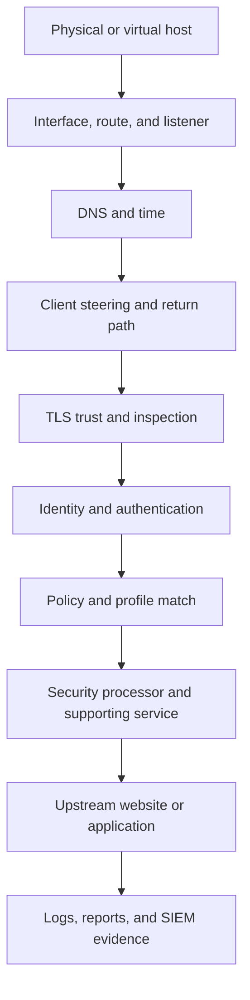

# Start With the Symptom, Not a Restart

A production incident often appears at the browser while the actual failure is in routing, DNS, TLS trust, identity, policy, a supporting service, an upstream dependency, or resource exhaustion. Preserve the failing state long enough to collect useful evidence, then test one boundary at a time.

<Warning>
  Do not disable inspection, authentication, access policy, malware scanning, DLP, or logging as an unrecorded troubleshooting shortcut. If a temporary exception is necessary, define its scope, owner, expiry, monitoring, and rollback in the incident record.
</Warning>

## Stabilize the incident

<Steps>
  <Step title="Protect users, data, and evidence">
    Determine whether the failure creates unsafe direct access, loss of inspection, missing logs, data exposure, or broad service disruption. Preserve relevant logs, configuration state, timestamps, and recent changes.
  </Step>
  <Step title="Define the exact symptom">
    Record who is affected, what action fails, where it fails, when it began, whether it ever worked, whether it is reproducible, and what changed.
  </Step>
  <Step title="Compare with a known-good path">
    Test a known-good user, endpoint, destination, protocol, node, and policy. Change one variable at a time.
  </Step>
  <Step title="Identify the failing layer">
    Follow the diagnostic order below. Stop when the first failed checkpoint explains the symptom.
  </Step>
  <Step title="Apply the smallest reversible correction">
    Prefer a documented repair or approved rollback. Record the exact action and starting state.
  </Step>
  <Step title="Verify the complete security path">
    Re-run routing, identity, TLS, policy, content, logging, and upstream tests. A browser loading one page is not sufficient recovery evidence.
  </Step>
</Steps>

## Diagnostic order

| Layer | First checkpoint | Typical evidence |
| --- | --- | --- |
| Host | Node is running and resources are not exhausted | Hypervisor or hardware state, CPU, memory, disk, system events |
| Network | Expected interfaces, routes, listeners, and health checks are active | Interface state, route table, listener output, load-balancer result |
| DNS and time | Names resolve through the approved path and clocks agree | Resolver output, NTP state, certificate timestamps, log timestamps |
| Client steering | The affected request reaches the intended SafeSquid node | Proxy settings, PAC result, packet path, access-log entry |
| TLS | The endpoint trusts the approved CA and the destination follows inspection policy | Certificate chain, fingerprint, client error, SSL event |
| Identity | The request has the intended user, device, group, and source | Authentication event, directory lookup, transaction fields |
| Policy | The expected rule and profiles match in the intended order | Policy trace, event fields, comparison request |
| Processor | Required scanner, feed, parser, or integration is healthy | Service status, update state, processor-specific log |
| Upstream | SafeSquid can resolve, connect, negotiate, and receive a valid response | Connection error, DNS result, TLS result, upstream status |
| Evidence | The final action reaches required logs, reports, and SIEM | Local event, forwarding status, destination receipt |

## Symptom guides

<CardGroup cols={2}>
  <Card title="Proxy refuses connections" icon="plug-zap" href="/troubleshooting/proxy_server_refusing_connection_error">
    Check node health, listener state, routing, firewall controls, and capacity.
  </Card>

  <Card title="Website is not accessible" icon="globe-x" href="/troubleshooting/website_not_accessible">
    Separate global connectivity, destination-specific, TLS, policy, and upstream failures.
  </Card>

  <Card title="DNS failure" icon="circle-off" href="/troubleshooting/dns_failure">
    Confirm resolver path, service state, recursion, forwarding, network reachability, and time.
  </Card>

  <Card title="SSL certificate error" icon="shield-alert" href="/troubleshooting/ssl_inspection_issues">
    Compare trust, validity, hostname, chain, pinning, time, and inspection scope.
  </Card>

  <Card title="SSO authentication fails" icon="user-x" href="/troubleshooting/sso_authentication_fail">
    Validate time, name resolution, directory reachability, credentials, browser behavior, and policy order.
  </Card>

  <Card title="Disk or RAM is full" icon="hard-drive" href="/troubleshooting/disk_space_and_ram_are_full">
    Preserve evidence, identify growth, protect current logs, restore capacity, and verify service health.
  </Card>

  <Card title="Whitelisted website is blocked" icon="list-x" href="/troubleshooting/whitelisted_website_blocked">
    Prove the request context, rule order, category, identity, inspection, and matching profile.
  </Card>

  <Card title="Installation fails" icon="package-x" href="/troubleshooting/installation_issues">
    Capture the installer message and logs before retrying or changing the host.
  </Card>
</CardGroup>

## Build the escalation package

Collect only what is relevant and sanitize it before transfer:

- Incident start time, timezone, severity, affected scope, and business impact
- Release train, exact build, node role, topology, and deployment method
- Expected behavior, observed behavior, and exact reproduction steps
- Recent configuration, certificate, network, identity, update, or infrastructure changes
- Relevant configuration export or checksum
- Narrow log window containing a correlation or client identifier
- Service, listener, dependency, resource, and time state
- Client, proxy, and upstream error text
- Tests already run and their results
- Temporary mitigations, exceptions, and rollback status

Do not include activation keys, private keys, passwords, session cookies, unrestricted packet captures, or unrelated customer traffic.

## Recovery acceptance

Recovery is complete only when:

1. The original symptom no longer occurs.
2. A known allow and deny decision match the approved policy.
3. Identity and TLS behavior are correct.
4. Required security processors and dependencies are healthy.
5. Logs, reports, and SIEM receive complete events with correct time.
6. Temporary exceptions are removed or have an approved owner and expiry.
7. The incident record identifies the failing boundary and documentation correction.