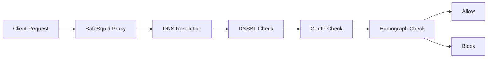

# DNS Security

## Problems addressed

Unrestricted DNS resolution reaches malicious, geo-noncompliant, or lookalike domains before HTTP policy runs. That wastes bandwidth, weakens compliance narratives, and feeds phishing risk.

## Outcomes operators expect

- Block or flag domains via DNSBL before TCP connections complete ([DNS Blacklisting](/DNSBL)).
- Apply geography- and ASN-aware context for policy and reporting ([Server Geo-Location](/GeoIP)).
- Reduce IDN homograph impersonation at resolution time ([Homograph Detection](/Homograph_Detection)).

## Advantages vs “HTTP-only” policy

DNS-layer controls fail closed earlier in the chain than URL filtering alone for many threats; combine with [Access Restriction](/Access_Restriction) and [Profiling Engine](/Profiling_Engine) for full coverage.

**Product-level comparative claims** (for example vs other SWG vendors): **Not SSOT-backed in this doc set**—see [What is SafeSquid SWG?](/safesquid_swg/what_is_safesquid_swg#architecture-and-positioning-claims-draft-vs-confirmed).

## Acquire, deploy, use

Configure DNS security features in the SafeSquid administration UI per each linked guide; verify blocks and log lines as described in those pages.

SafeSquid provides DNS-level security at the domain resolution layer: DNS-based blacklisting, geographic IP filtering, and internationalized domain name (IDN) homograph detection. For architecture placement inside SWG, see [Integrated DNS Security](/Integrated_DNS_Security).

**Why DNS-level security matters:** Blocking threats at DNS resolution (before connection) is faster and more efficient than content inspection. DNS security provides early threat mitigation, reduces bandwidth waste, and creates audit evidence before users reach malicious sites.

## DNS security controls and configuration

### [DNS Blacklisting](/DNSBL)
Unrestricted DNS resolution allows access to known-malicious domains and increases malware, phishing, and compliance risk. DNSBL blocks dangerous sites before connection by querying DNS-based blacklist services. Blocking at resolution reduces exposure and supports audit evidence in logs and reports. Configure DNSBL in Real-time content security and verify blocks in Security Logs.

### [Server Geo-Location](/GeoIP)
Organizations face regional compliance gaps and threat exposure when destination geography is unknown. Server Geo-Location classifies destinations by country and ASN for location-aware policies. Country-based access control and reporting support data residency and geo-restriction requirements. Enable geo profiles in Profiling Engine and reference them in Access Restriction and Reporting.

### [Homograph Detection](/Homograph_Detection)
IDN homograph attacks use visually similar characters to impersonate legitimate domains and enable phishing. Homograph detection identifies and blocks these impersonation attempts at DNS resolution. The control reduces lookalike-domain risk and supports evidence in DNS security logs. Configure allowed or blocked IDN patterns in DNS Security when the feature is available.

## Source register

| Topic | Status | Source |
| ----- | ------ | ------ |
| DNSBL integration and policy flow | **Confirmed** | [DNS Blacklisting](/DNSBL), [Integrated DNS Security](/Integrated_DNS_Security) |
| GeoIP / `server_country` style fields | **Confirmed** | [Server Geo-Location](/GeoIP) |
| Homograph UI availability by version | **Confirmed** | [Homograph Detection](/Homograph_Detection) (version checks) |

## Next steps

Use DNS security together with [Access Restriction](/Access_Restriction) and [Profiling Engine](/Profiling_Engine) for URL and application policy; see [Integrated DNS Security](/Integrated_DNS_Security) for architecture context.
