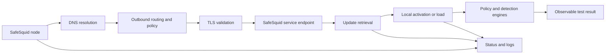

# Validate threat-intelligence dependencies

Threat data can influence categorization, reputation, malware detection, certificate decisions, and other security controls. A production design must prove which data sources the target build consumes, how freshness is exposed, and what enforcement does when updates fail.

<Warning>
  The names, coverage, endpoints, refresh behavior, subscription requirements, and failure modes of SafeSquid intelligence services have not yet been reproduced for the listed release trains. Do not use phrases such as "real time" or "zero threat window" as assurance claims without measured evidence.
</Warning>

## Outcome

You will have:

- An inventory of intelligence-dependent controls exposed by the target build.
- Documented network and licensing dependencies.
- A known-good freshness baseline.
- Alert thresholds for stale or failed updates.
- A tested recovery path.
- Evidence that one safe policy test reflects the expected intelligence state.

| Item | Value |
| --- | --- |
| Intended reader | Threat-protection engineer, network technician, SOC operator |
| When to use | Deployment planning, release validation, incident diagnosis, or feed-path changes |
| Estimated time | 45-90 minutes, excluding a controlled failure test |
| Change impact | Blocking update traffic or changing subscriptions can reduce control currency |
| Maintenance requirement | Recheck after release, license, egress, DNS, TLS, proxy-chain, or endpoint changes |

## Dependency flow

A successful network connection alone does not prove that new data was accepted or used by policy.

## Input worksheet

| Input | Where to obtain it | Valid form | Safe example | Sensitive? |
| --- | --- | --- | --- | --- |
| Exact build | Product support or build display | Full identifier | Build under test | No |
| Activated entitlements | Portal or support record | Named features and expiry | Threat protection enabled | Yes |
| Update service names | Build-specific interface, schema, or approved source | Exact service labels | Categorization data | No |
| Required endpoints | Approved product dependency record | FQDN, port, protocol, purpose | updates.example.invalid:443 | No |
| Egress path | Network design | Direct, upstream proxy, or controlled gateway | Upstream proxy | No |
| Trust path | Certificate design | Trust store and inspection treatment | Dedicated bypass decision | Yes |
| Freshness indicator | Interface, API, or log evidence | Version, timestamp, status, or hash | 2026-08-07T10:00Z | No |
| Staleness threshold | Security decision record | Duration and severity | Alert after 2 expected cycles | No |
| Failure behavior | Product evidence and policy decision | Continue, fail closed, degrade, or unknown | Unknown until test | No |
| Evidence location | Controlled test record | Case or repository reference | VAL-THREAT-004 | Yes |

Do not publish account identifiers, activation keys, bearer tokens, private endpoints, or unredacted logs.

## Establish the supported inventory

1. Record every intelligence or update service visible in the target build.
   **Checkpoint:** each entry has an exact interface label, schema field, command output, or log source. Marketing names alone are not sufficient.
2. Map each service to the control that consumes it.
   **Checkpoint:** every feed has an owner and a testable security effect. Remove assumed relationships.
3. Obtain the approved endpoint and entitlement record.
   **Checkpoint:** each destination has a purpose, port, protocol, trust treatment, and source of authority.
4. Record current version, last-success time, last-attempt time, and status where exposed.
   **Checkpoint:** the values come from the SafeSquid node under test and include the node time and time zone.

## Prove normal operation

1. Confirm DNS resolution and outbound routing from the actual SafeSquid path.
   **Expected:** the approved destination resolves and the connection follows the intended egress route.
2. Confirm TLS behavior.
   **Expected:** the node accepts the service certificate through the approved trust path. Any inspection bypass is explicit and justified.
3. Observe one complete update cycle or an approved manual check.
   **Expected:** the service records a successful retrieval or check without authentication, entitlement, parsing, storage, or activation errors.
4. Confirm local activation.
   **Expected:** the version, timestamp, hash, or other build-supported freshness indicator changes or is explicitly confirmed current.
5. Run a safe policy test.
   **Expected:** a synthetic or vendor-approved test case produces the documented policy action and a correlated event.

## Controlled failure test

Perform this only in a lab or approved maintenance window.

1. Record the healthy state and expected update interval.
2. Block one selected update dependency at the narrowest possible scope.
3. Observe connection errors, retry behavior, local status, alerts, and policy behavior.
4. Determine whether the control continues with cached data, degrades, fails closed, or fails open.
5. Restore the dependency.
6. Confirm a successful update and repeat the safe policy test.

<Warning>
  Never use live malicious content to prove a feed. Use synthetic indicators, inert vendor test artifacts, or a dedicated lab approved by the security team.
</Warning>

## Failure isolation

| Observation | Discriminating test | Likely area |
| --- | --- | --- |
| Name does not resolve | Query using the node's configured resolver | DNS |
| TCP connection fails | Test route, firewall, and upstream proxy separately | Network path |
| TLS fails | Inspect time, trust chain, hostname, and interception | TLS trust |
| Service rejects the request | Compare activation and entitlement state | Licensing or authentication |
| Download succeeds but version does not change | Inspect parsing, storage, and activation events | Local update processing |
| One node is stale | Compare route, time, configuration, and build per node | Node inconsistency |
| Status is current but policy test fails | Trace identity, policy order, and consuming engine | Enforcement path |
| Recovery does not occur | Inspect retry schedule and approved restart requirement | Recovery behavior |

## Recovery verification

Complete the incident only when:

- The approved endpoints resolve and connect from every affected node.
- TLS and entitlement checks succeed.
- The local freshness indicator is current.
- Update errors stop or return to the established baseline.
- The safe policy test succeeds.
- Clustered nodes show an acceptable and documented consistency state.
- The outage window and security exposure decision are recorded.

## Evidence to retain

- Exact build, node, time zone, and topology.
- Approved dependency and entitlement records.
- Healthy and failed freshness indicators.
- Sanitized update and policy events.
- Failure-injection scope and approvals.
- Observed stale-data or fail-state behavior.
- Recovery timestamps and final test result.
- Any discrepancy between documentation and product behavior.

Related guidance:

- [Malware scanners](/use_cases/malware_scanning/malware_scanners)
- [Web categorization](/use_cases/access_restriction/web_categorization)
- [Documentation trust](/reference/documentation-trust)
- [Troubleshooting method](/troubleshooting/troubleshooting)