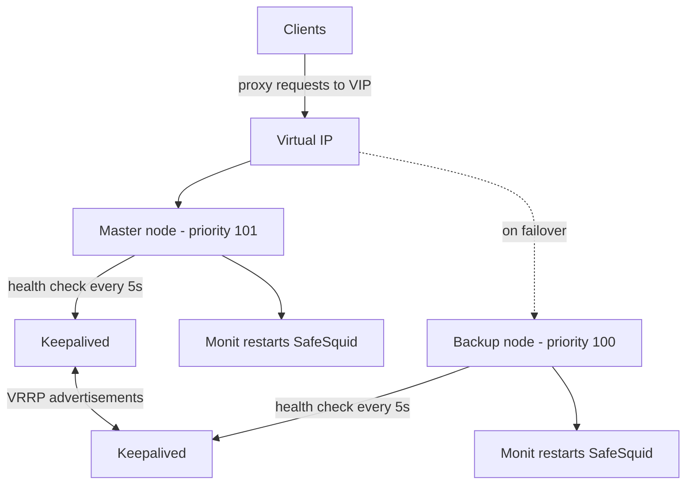

{/* source: _migration_source_v3/03-High Availability Monit Keepalived.md (whole page) */}
{/* NEEDS-SME-REVIEW: source states testing on Ubuntu VMs with Monit 5.34.x and Keepalived 2.x only. Platform scope unverified for RHEL-family hosts and the current SafeSquid release. */}

# Survive a Proxy Node Failure

A single SafeSquid node is a single point of failure for every user behind it. When the proxy stops answering, browsing stops — and so does policy enforcement, logging, and the audit trail that proves enforcement happened. Users escalate, and the fastest workaround an impatient administrator reaches for is disabling the proxy entirely.

Active-passive high availability removes that pressure. Clients connect to a virtual IP (VIP) that always points at a healthy node. Keepalived moves the VIP on failure in 2–3 seconds; Monit independently restarts a crashed SafeSquid process on either node.

## Split responsibilities between two tools

Keepalived and Monit solve different problems. They do not conflict — running only one leaves a gap.

| Layer | Keepalived | Monit |
|---|---|---|
| Purpose | VIP ownership via VRRP | Application health and process management |
| Failover trigger | Health-check script exits non-zero | PID file missing or port not responding |
| Failover speed | 2–3 seconds | 30–60 seconds |
| Split-brain protection | Prevented by VRRP priority election | Not provided; mitigated by priority weights |
| Restarts SafeSquid | No | Yes |

Keepalived runs the health-check script every 5 seconds. If SafeSquid is not serving traffic, Keepalived drops the Master's VRRP priority below the Backup's and the VIP moves. Monit restarts SafeSquid on the failed node and logs the event.



## Match the design to the failure

| Failure | What happens | Result for users |
|---|---|---|
| SafeSquid stops answering on the Master | Keepalived detects the failed check and moves the VIP | Clients reconnect within 2–3 seconds |
| SafeSquid process crashes | Monit finds no PID and restarts the service | No administrator action needed |
| Network partition between nodes | VRRP priority election keeps one owner | Split brain is prevented by design |
| Planned maintenance on the Master | Stop SafeSquid; the Backup takes the VIP | Zero-downtime maintenance window |

## Prerequisites

- Two SafeSquid instances installed and activated — one Master, one Backup.
- Both nodes on the same subnet, so VRRP advertisements reach both.
- One unused IP address for the VIP. It must not be assigned to any other host or DHCP pool.
- Root or sudo access on both nodes.
- Firewall rules permitting VRRP (IP protocol 112) between the two nodes.
- `keepalived`, `monit`, and `curl` available from the distribution repositories.

Record the environment before you start. The examples below use these values — substitute your own throughout.

| Component | Example value | Notes |
|---|---|---|
| Master node | `MASTER-IP` | Active node, VRRP priority 101 |
| Backup node | `BACKUP-IP` | Standby node, VRRP priority 100 |
| Virtual IP | `VIP-ADDRESS` | Clients always connect to this address |
| Network interface | `INTERFACE` | Confirm the name on both nodes with `ip a` |
| SafeSquid port | `8080` | Monitored by Keepalived and Monit |

<Warning>
Point clients at the VIP, not at either node address. A PAC file, GPO, or MDM profile that names the Master directly will not fail over.
</Warning>

## Install both packages on both nodes

Run this on the Master and the Backup:

```bash
sudo apt update && sudo apt install keepalived monit curl -y
```

Expected result: both services install and are available to `systemctl`.

## Create the health-check script

Keepalived runs this script every 5 seconds. A non-zero exit drops the node's VRRP priority and triggers VIP handover.

Create `/etc/keepalived/check_safesquid.sh` on **both** nodes:

```bash
#!/bin/bash
# Health check for SafeSquid, run by Keepalived.
# Exit 0 = healthy. Exit 1 = failed, triggers priority drop.

PORT=8080
TIMEOUT=3

# Check 1: is the SafeSquid service active?
if ! systemctl is-active --quiet safesquid; then
  echo "$(date): SafeSquid service not active" >> /var/log/keepalived_check.log
  exit 1
fi

# Check 2: is SafeSquid answering on the proxy port?
if ! curl -s --max-time $TIMEOUT -x 127.0.0.1:$PORT http://safesquid.cfg > /dev/null 2>&1; then
  echo "$(date): SafeSquid port $PORT not responding" >> /var/log/keepalived_check.log
  exit 1
fi

exit 0
```

Make it executable on both nodes:

```bash
sudo chmod +x /etc/keepalived/check_safesquid.sh
```

The second check matters. A process that is running but not accepting connections still fails users, and a PID check alone will not catch it.

## Configure Keepalived on both nodes

Only `state` and `priority` differ between the two files. Everything else must match exactly.

<Warning>
`virtual_router_id` must be identical on both nodes, and `auth_pass` must be identical and **8 characters or fewer** — Keepalived truncates longer values, which produces a silent mismatch and two Masters.
</Warning>

<Tabs>
  <Tab title="Master node">

Write `/etc/keepalived/keepalived.conf`:

```conf
global_defs {
  router_id PROXY_HA
  script_user root
  enable_script_security
}

vrrp_script check_safesquid {
  script "/etc/keepalived/check_safesquid.sh"
  interval 5       # Run the check every 5 seconds
  weight -101      # Drop priority by 101 on failure
  fall 2           # Fail after 2 consecutive failures
  rise 2           # Recover after 2 consecutive successes
}

vrrp_instance SAFESQUID_VIP {
  state MASTER
  interface INTERFACE
  virtual_router_id 51
  priority 101            # Higher than Backup, so it wins the election
  advert_int 1            # Advertise every 1 second
  nopreempt               # VIP stays on the Backup after recovery

  authentication {
    auth_type PASS
    auth_pass SafeSqid    # Identical on both nodes, 8 characters maximum
  }

  virtual_ipaddress {
    VIP-ADDRESS/32 dev INTERFACE
  }

  track_script {
    check_safesquid
  }
}
```

  </Tab>
  <Tab title="Backup node">

Write `/etc/keepalived/keepalived.conf`:

```conf
global_defs {
  router_id PROXY_HA
  script_user root
  enable_script_security
}

vrrp_script check_safesquid {
  script "/etc/keepalived/check_safesquid.sh"
  interval 5
  weight -101
  fall 2
  rise 2
}

vrrp_instance SAFESQUID_VIP {
  state BACKUP
  interface INTERFACE
  virtual_router_id 51
  priority 100            # Lower than Master, so it yields
  advert_int 1
  nopreempt

  authentication {
    auth_type PASS
    auth_pass SafeSqid    # Must match the Master exactly
  }

  virtual_ipaddress {
    VIP-ADDRESS/32 dev INTERFACE
  }

  track_script {
    check_safesquid
  }
}
```

  </Tab>
</Tabs>

### Why the weight is -101

The weight must push the Master's effective priority below the Backup's, not merely reduce it.

- The Master starts at priority 101.
- On check failure, `weight -101` makes the effective priority `101 - 101 = 0`.
- `0` is below the Backup's `100`, so the Backup wins the VRRP election, advertises the higher priority, and the Master releases the VIP.

A weight of `-60` yields `101 - 60 = 41`. That is still below 100, but it does not reliably drive the BACKUP state transition across Keepalived versions. Use `-101` so the outcome is unambiguous.

## Configure Monit on both nodes

Monit supervises the SafeSquid process and restarts it. It does not touch the VIP — that stays with Keepalived.

Write `/etc/monit/conf.d/safesquid.monit` on both nodes:

```conf
check process safesquid_proxy_service with pidfile /var/run/safesquid/safesquid.pid
  group root
  start program = "/usr/bin/systemctl start safesquid.service" with timeout 60 seconds
  stop program  = "/usr/bin/systemctl stop safesquid.service" with timeout 60 seconds
  if does not exist then restart
  if 3 restarts within 5 cycles then alert
  mode active
```

<Note>
Keep `set daemon` and `set httpd` in `/etc/monit/monitrc` only. Repeating them here produces an `address option specified twice` error and Monit refuses to start.
</Note>

## Start both services

Run on both nodes:

```bash
sudo systemctl enable keepalived
sudo systemctl start keepalived
sudo systemctl enable monit
sudo systemctl restart monit
```

Confirm the VIP landed on the Master:

```bash
ip a show INTERFACE | grep VIP-ADDRESS
```

Expected output on the Master only:

```
inet VIP-ADDRESS/32 scope global proto keepalived INTERFACE
```

The `proto keepalived` tag confirms Keepalived owns the address and will withdraw it automatically on failover. An address without that tag was assigned statically and will not move.

## Verify and evidence failover

Confirm the Master state and a passing health check:

```bash
sudo systemctl status keepalived
sudo journalctl -u keepalived -n 30 --no-pager
```

Expected output on the Master includes:

```
(SAFESQUID_VIP) Entering MASTER STATE
VRRP_Script(check_safesquid) succeeded
```

### Test the failover

Open two terminals. Watch the log on the Backup while you stop SafeSquid on the Master.

```bash
# Backup node: follow the Keepalived log
sudo journalctl -u keepalived -f
```

```bash
# Master node: trigger the failure
sudo systemctl stop safesquid
```

Within 10–15 seconds the log shows the handover:

```
(SAFESQUID_VIP) Changing effective priority from 101 to 0
(SAFESQUID_VIP) Master received advert from BACKUP-IP with higher priority 100
(SAFESQUID_VIP) Entering BACKUP STATE
(SAFESQUID_VIP) Transition to MASTER STATE
Sending gratuitous ARP on INTERFACE for VIP-ADDRESS
```

Confirm the VIP moved:

```bash
ip a show INTERFACE | grep VIP-ADDRESS
```

Restore SafeSquid on the Master after the test:

```bash
sudo systemctl start safesquid
```

<Note>
`nopreempt` keeps the VIP on the Backup after the Master recovers. This avoids a second interruption during business hours. To move the VIP back deliberately, restart Keepalived on the Master: `sudo systemctl restart keepalived`.
</Note>

### Capture HA evidence

Store these artifacts with the change record:

- Both `keepalived.conf` files and the health-check script, with a checksum.
- `journalctl -u keepalived` extract covering the tested failover, showing the state transition and gratuitous ARP.
- `ip a` output before and after failover, showing VIP ownership on each node.
- `/var/log/keepalived_check.log` and `/var/log/monit.log` for the test window.
- Client-side proof that browsing resumed through the VIP, plus the SafeSquid access log entries from the surviving node.
- The date of the last tested failover and the named owner of the next test.

<Warning>
Untested failover is not high availability. Schedule a failover test on the same cadence as your disaster-recovery restore test and keep the evidence.
</Warning>

## Troubleshoot HA failures

| Symptom | Cause | Fix |
|---|---|---|
| Both nodes report MASTER | `virtual_router_id` or `auth_pass` mismatch | Set `virtual_router_id 51` and an identical `auth_pass` on both nodes |
| VIP not assigned at Master startup | Invalid VIP format in the config | Run `keepalived --config-test -f /etc/keepalived/keepalived.conf`; the VIP must be a valid IPv4 address |
| VIP not released after a failed check | `weight` does not drop priority below the Backup | Use `weight -101` so the effective priority reaches 0 |
| Keepalived does not start | Configuration syntax error | Run `keepalived --config-test -f /etc/keepalived/keepalived.conf` and correct the reported line |
| `auth_pass` truncation warning in the log | Password longer than 8 characters | Shorten to 8 characters or fewer and apply the same value on both nodes |
| VRRP advertisements never arrive | Firewall blocks IP protocol 112 | Allow protocol 112 between the nodes, for example `sudo ufw allow proto 112` |
| Monit reports `address option specified twice` | Global settings duplicated in `safesquid.monit` | Remove `set daemon` and `set httpd`; keep them in `/etc/monit/monitrc` |
| VIP stays on the Backup after the Master recovers | `nopreempt` is set, which is intended | Restart Keepalived on the Master to move the VIP back |

## File reference

| Path | Purpose |
|---|---|
| `/etc/keepalived/keepalived.conf` | VRRP state, priority, VIP, and health-check binding |
| `/etc/keepalived/check_safesquid.sh` | Health check run every 5 seconds |
| `/etc/monit/monitrc` | Monit global configuration |
| `/etc/monit/conf.d/safesquid.monit` | SafeSquid process supervision and alerting |
| `/var/log/keepalived_check.log` | Health-check failure log |
| `/var/log/monit.log` | Monit activity log |

### Master and Backup differences

| Setting | Master | Backup |
|---|---|---|
| `state` | `MASTER` | `BACKUP` |
| `priority` | `101` | `100` |
| `weight` | `-101` | `-101` |
| `nopreempt` | Set | Set |
| `virtual_router_id` | `51` | `51` (must match) |
| `auth_pass` | Identical on both nodes | Identical on both nodes |
| `virtual_ipaddress` | Same VIP | Same VIP |
| `check_safesquid.sh` | Identical on both nodes | Identical on both nodes |

## Next steps

- [Proxy Clustering](/use_cases/scaling_and_high_availability/proxy_clustering) - scale enforcement across more than two nodes.
- [Configuration Sync](/use_cases/customisation/configuration_sync) - keep policy identical on both HA nodes.
- [Disaster Recovery](/use_cases/scaling_and_high_availability/disaster_recovery) - plan rebuild and restore beyond node failover.
