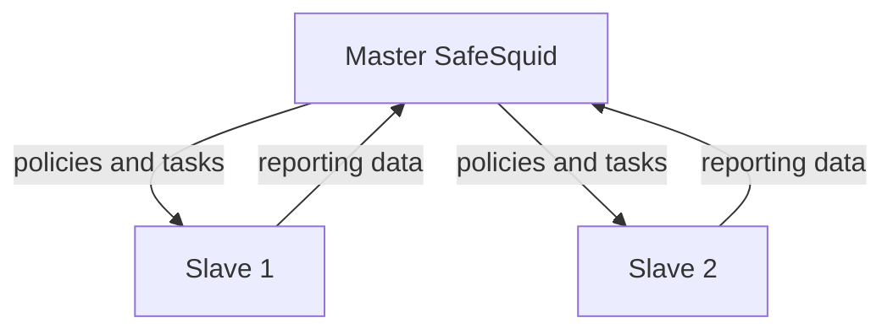

## How master-slave works

In a master-slave configuration, one SafeSquid instance (the master) manages policy and reporting for multiple slave instances. Slaves enforce policy and process traffic; master provides centralized control.

**Data flow:**
- **Master → Slaves**: Policies, configuration, tasks
- **Slaves → Master**: Reporting data, logs, statistics

Control and policy flow from master to slaves; reporting data flows from slaves to master:

**Slave behavior:**
- Processes client traffic and enforces policy synced from master
- Forwards reporting data to master for centralized analysis
- Operates independently if master is temporarily unavailable (uses last synced policy)

**Master behavior:**
- Does not process client traffic directly
- Aggregates reporting data from all slaves into unified reports
- Pushes policy updates to slaves automatically

## Prerequisites

- SafeSquid installed on all nodes (master and slaves)
- Same activation key on all nodes
{/* source: live UI verification, Support → Startup params, and this page's own screenshot evidence (image3, image5-8, image15) */}
{/* NEEDS-SME-REVIEW: this page previously stated the master Configuration Portal listens on "port 8888 by default". No UI section or product log on the verified live instance names 8888. The MASTER_PORT field entered in this page's own screenshots (image3, image5, image6) is 8080, matching the master's configured LISTEN_PORT, and image15's raw sync log records the actual sync connection as `192.168.221.222:8080`. Confirm whether 8888 is ever used (e.g. a distinct clustering listener on some builds) — this is the same open question flagged on use_cases/customisation/configure_cloud_restore.md's ":8888" claim and use_cases/scaling_and_high_availability/proxy_clustering.md. */}
- Network access from slaves to master's configured proxy port (the same LISTEN_PORT the master serves its Configuration Portal on — 8080 in this page's own screenshots; verify the actual port on your master under Support → Startup params before connecting a slave)
- If authentication is enabled on master, slaves must be allowed in Access restrictions → Allow list

## Configure master-slave relationship

Follow these steps to connect a slave instance to a master. Perform slave configuration first, then (if authentication is enabled) configure the master to allow the slave.

## Step 1: Configure slave server

### [Access the SafeSquid User Interface](/Configuration_Portal) on the slave server

## Go to Support

## Go to Startup params

## Step 2: Configure master server (if authentication is enabled)

If your master requires authentication, add the slave IP to the Allow list so the slave can access the Configuration Portal and sync policies.

### Go to Access restrictions under Application Setup

## Go to Allow list

## Step 3: Verify synchronization

### Check slave configuration sync

On the slave Configuration Portal, confirm that sections synced from the master appear with the same settings. Make a test policy change on the master and verify it appears on the slave within a few minutes.

### Verify reporting flow

On the master, open [Reporting Service](/Reporting_Service) and confirm logs from slave nodes appear in unified reports. Slave traffic should be visible on the master.

## Verification checklist

- [ ] Slave Configuration Portal → Support → Startup params shows correct master IP and port
- [ ] Master Configuration Portal → Access restrictions → Allow list includes slave IP (if authentication enabled)
- [ ] Test policy change on master propagates to slave within 5 minutes
- [ ] Slave traffic appears in master Reporting Service
- [ ] Slave logs show successful sync events (check `/var/log/safesquid/extended.log`)

## Troubleshooting

**Slave not syncing policies:**
- Verify network connectivity from slave to the master's configured LISTEN_PORT (8080 in this page's verified screenshots; confirm the actual value on the master under Support → Startup params): `telnet <master-ip> <master-port>`
- Check master firewall allows incoming connections on that port
- If authentication enabled, verify slave IP in master Access restrictions → Allow list
- Check slave logs: `tail -f /var/log/safesquid/extended.log` (look for sync errors)

**Slave traffic not appearing in master reports:**
- Verify reporting data path is not blocked by firewall
- Check slave Configuration Portal → Support → Startup params has correct master IP
- Restart slave: Configuration Portal → Support → Restart SafeSquid

**Policies syncing but not applying:**
- After policy changes on master, restart slave to apply: Configuration Portal → Support → Restart SafeSquid
- Verify slave activation key matches master (same license)

**Related**: [Configuration Sync](/Configuration_Sync), [Configuration Portal](/Configuration_Portal), [Reporting Service](/Reporting_Service), [Troubleshooting](/Troubleshooting)

